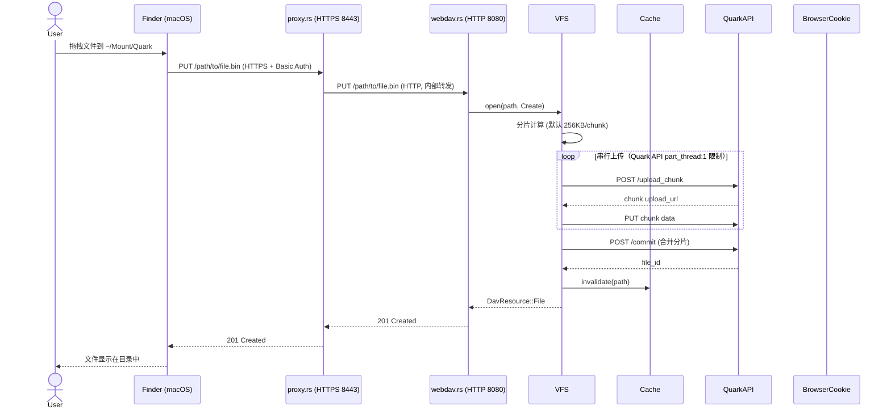
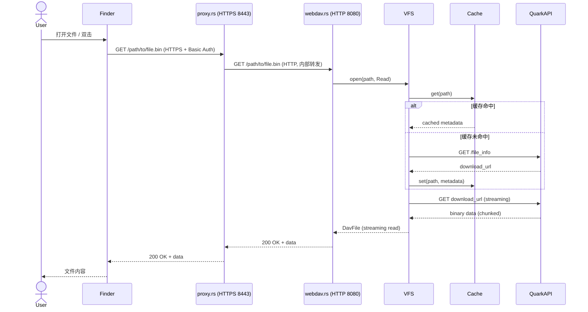

# QuarkDrive-WebDAV 架构文档

> 本文档描述 QuarkDrive-WebDAV 的系统架构、模块职责和数据流。
> 版本：2026-07-05 | 状态：活跃开发中
> 仓库根：`/Users/HawkSept/myproject/myapp/localquark-rust`

---

## 系统架构概览

```mermaid
flowchart TB
flowchart LR
    subgraph macOS["macOS"]
        Finder["Finder (mount_webdav)"]
        Tray["菜单栏托盘 (tray.rs)"]
        Keychain["Keychain"]
        Browser["Chromium Cookie DB"]
    end

    subgraph Daemon["quarkdrive-webdav (单进程 tokio runtime)"]
        Proxy["proxy.rs\nHTTPS 终结代理\n127.0.0.1:8443"]
        Backend["webdav.rs\nHTTP WebDAV 后端\n127.0.0.1:8080"]
        VFS["vfs.rs\n虚拟文件系统"]
        Cache["cache.rs (Moka)"]
        Cookie["cookie.rs"]
        Health["health.rs (60s)"]
        Mount["mount.rs (mount_webdav -S)"]
        Main["main.rs 编排器"]
    end

    QuarkAPI["夸克网盘 API\ndrive.quark.cn"]

    Finder -->|HTTPS 8443 + Basic Auth| Proxy
    Proxy -->|HTTP 8080| Backend
    Backend --> VFS
    VFS --> Cache
    VFS -->|分片上传/下载| QuarkAPI
    VFS -->|元数据| QuarkAPI
    Cookie -->|驱动| VFS
    Browser --> Cookie
    Keychain --> Cookie
    Health --> Mount
    Health --> Cookie
    Tray --> Main
    Main --> Proxy
    Main --> Backend
    Main --> Mount
    Main --> Cookie
```

> **关键设计动机**：macOS 26.6+ 的 `webdavfs_agent` 拒绝 HTTP + Basic Auth（错误原文 `Authentication method (Basic) too weak`）。所以 daemon 必须内置一个 HTTPS 终结代理层：backend 仍走 HTTP（方便 `curl` 调试），对外只暴露 8443 HTTPS 给 `mount_webdav`。架构图来自 `legacy/LocalQuark-python-bundle/decoded/DECOMPILED.md` 的设计文档。

---

## 模块职责

### main.rs —— 启动编排器
- **职责**：应用入口，负责初始化所有模块并协调生命周期
- **关键逻辑**：
  1. 解析 CLI（`clap` derive），默认值见 [README.md 参数表](README.md)
  2. 初始化 `tracing_subscriber` 日志（`RUST_LOG` 环境变量或 `--debug`）
  3. 构建 `CookieStore`（`--quark-cookie` 显式传则跳过浏览器抓取）
  4. 构建 `QuarkDriveFileSystem`（VFS 实例）
  5. 启动 WebDAV **后端**（HTTP 8080，仅本地）
  6. 启动 **HTTPS 终结代理**（8443，自签证书，对外）
  7. **挂载前根 PROPFIND 预热**（`--warm-root`，避免 Finder 短暂空目录）
  8. 调用 `mount::mount()` 挂载到 `--mount-point`（默认 `~/Mount/Quark`）
  9. 启动健康检查轮询 loop（`--health-check-secs`，默认 60s）
 10. 启动定时 cookie 刷新（`--cookie-refresh-secs`，默认 12h）
 11. 启动菜单栏托盘（macOS 独占）
 12. 等待 SIGTERM/SIGINT 或托盘退出，graceful shutdown

### proxy.rs —— HTTPS 终结代理
- **职责**：解决 macOS 26.6+ `webdavfs_agent` 拒绝 HTTP+Basic Auth 的硬性要求
- **协议**：TLS 1.2 + ALPN `http/1.1`（`tokio_rustls`）
- **端口**：`--host` / `--port`（默认 `127.0.0.1:8443`）
- **后端转发**：把所有 HTTPS 请求解包后转发到 `--backend-host` / `--backend-port`（默认 `127.0.0.1:8080`）
- **自签证书**：`ensure_tls()` 启动时检查 `~/Library/Application Support/QuarkDrive/cert.pem` + `key.pem`，不存在则用 `/usr/bin/openssl req -x509 -newkey rsa:2048 -nodes -days 3650 -addext subjectAltName=IP:127.0.0.1` 生成
- **关键不变量**：8443 是唯一对外端口；8080 必须只绑定 `127.0.0.1`

### vfs.rs —— 虚拟文件系统
- **职责**：实现 `DavFileSystem` trait，将 WebDAV 操作映射到夸克网盘 API
- **核心方法**：
  - `open(path, options)`：打开文件（懒加载远程文件）
  - `read_dir(path)`：目录列表（带缓存）
  - `create_file(path)`：创建新文件（分片上传）
  - `remove_file / remove_dir`：删除文件/目录
- **缓存策略**：使用 `moka` 内存缓存，目录列表 TTL 60 秒
- **性能优化**：
  - ❌ Phase 1: `buffer_unordered(4)` 已回滚为串行（Quark API `part_thread:1` 不支持并发）
  - ✅ Phase 2: 移除多余的 `sleep` 延迟
  - ✅ Phase 3: 移除 `consume_buf` 的每写 `flush()`
  > 详细原因与替代方案见 [docs/PERFORMANCE.md](docs/PERFORMANCE.md)

### webdav.rs —— HTTP 请求处理
- **职责**：基于 `dav-server` crate，处理 WebDAV HTTP 协议
- **支持方法**：PROPFIND、PROPPATCH、MKCOL、GET、HEAD、PUT、DELETE、COPY、MOVE、LOCK、UNLOCK
- **认证**：Basic Auth（用户名密码从命令行参数传入）
- **TLS**：支持自签名证书（HTTPS 8443 端口）

### mount.rs —— macOS 挂载管理
- **职责**：封装 macOS `mount_webdav` 命令，挂载 WebDAV 到本地目录
- **挂载命令**：
  ```bash
  mount_webdav -S -o url=https://127.0.0.1:8443,username=<u>,password=<p> /Volumes/LocalQuark
  ```
  - `-S`：允许自签证书（HTTPS 终结代理必需）
  - `url` / `username` / `password` 走 `shell_escape` 防 `,` `=` 注入
- **自动挂载**：启动时自动挂载，故障时 health.rs 自动重挂
- **挂载点默认值**：
  - CLI 二进制：`~/Mount/Quark`（`expand_home` 展开）
  - bundled `.app`：`/Volumes/LocalQuark`（`scripts/build-app.sh` 中 launcher 模板）
- **限制**：macOS 13+ 已稳定，旧版本不承诺
- **持久化凭据**：`mount::write_passwd` 把 WebDAV 密码写到 `~/Library/Application Support/QuarkDrive/webdav.passwd`（0o600）

### cookie.rs —— Chromium Cookie 抓取
- **职责**：从浏览器 SQLite Cookie 库中解密提取夸克网盘 Cookie
- **支持的浏览器**：Chrome、Brave、Edge、Arc、Chromium（优先级排序）
- **解密流程**：
  1. 从 Keychain 获取 Chrome Safe Storage 密码
  2. PBKDF2-HMAC-SHA1 派生 AES 密钥
  3. 复制 SQLite 到临时目录（避免锁库）
  4. AES-128-CBC 解密 v0/v10/v11 格式 cookie
  5. 验证并返回 `sl-session` 等关键字段

### health.rs —— 健康检查与自动重挂
- **职责**：每 60 秒执行一次健康检查，自动修复故障
- **检查项**：
  1. Cookie 有效性（`sl-session` 存在且未过期）
  2. WebDAV 服务响应（`OPTIONS /` 返回 200）
  3. 挂载点状态（`/sbin/mount` 输出包含挂载路径）
- **故障恢复**：
  - Cookie 失效 → 调用 `CookieStore::from_chromium()` 重新抓取
  - WebDAV 不可达 → 重启 WebDAV 服务进程
  - 挂载掉了 → 调用 `mount::mount()` 重新挂载

### tray.rs —— macOS 菜单栏托盘
- **职责**：原生系统托盘，提供状态显示和用户交互
- **菜单项**：
  - 状态显示：在线 / 未挂载 / Cookie 失效
  - 立即刷新 Cookie：手动触发 Cookie 重新抓取
  - 在 Finder 中显示：`open ~/Mount/Quark`
  - 退出：取消所有任务 → 卸载挂载点 → 退出应用
- **实现技术**：`tray-icon` crate（避免 Tauri 多开 WebView）

### cache.rs —— 内存缓存
- **职责**：缓存文件元数据和目录列表，减少 API 调用
- **实现**：基于 `moka` 的高性能并发缓存
- **TTL 策略**：目录列表 60 秒，文件元数据 300 秒

### proxy.rs —— HTTP/HTTPS 代理
- **职责**：本地代理层，用于调试和流量分析
- **支持**：HTTP CONNECT、HTTPS 透明代理

---

## 数据流图

### 文件上传流（PUT）



### 文件下载流（GET）



---

## 关键设计决策

### 0. 为什么需要 HTTPS 终结代理？
- **问题**：macOS 26.6+ 的 `webdavfs_agent` 拒绝 HTTP + Basic Auth，日志原文 `Mount failed, Authentication method (Basic) too weak`
- **解法**：daemon 内部 backend 仍走 HTTP（开发期 `curl` 调试方便），对外通过 `proxy.rs` 起一个自签证书的 HTTPS 终结层
- **收益**：8080 仍可裸 `curl` 调试；8443 满足 `mount_webdav` 的硬性要求；用户无感知

### 1. 为什么不用 macFUSE / fuse-t？
- **理由**：macFUSE 需要内核扩展（kext），macOS 14+ 用户需手动在系统设置中开启，体验差
- **选择**：`mount_webdav` 是 macOS 原生命令，零额外依赖，用户无感知

### 2. 为什么用 `tray-icon` 而不是 Tauri？
- **理由**：Tauri 拉取整个 WebView，体积大（~20MB+），启动慢
- **选择**：`tray-icon` 仅提供原生系统托盘，轻量（几百KB），启动快

### 3. 为什么缓存目录列表而不是实时请求？
- **理由**：夸克网盘 API 有速率限制，频繁请求会触发 429
- **选择**：Moka 内存缓存 + 60 秒 TTL，平衡实时性和性能

### 4. 为什么上传走串行而不是 `buffer_unordered(4)` 并发？
- **现状**：`upload_chunk` / `do_flush` 中都是普通 `for chunk_idx in 1..=chunk_count` 循环，**不是**并发
- **历史尝试**：早期版本用 `futures::stream::iter().buffer_unordered(4)`，5MB 上传从 ~30s 降到 ~8s
- **回滚原因**：夸克网盘上传 API 元数据返回 `part_thread:1`，并发 chunk 触发 `PartNotSequential` 错误并返回 500
- **改进空间**：待 Quark API 支持并发后再启用；详见 [docs/PERFORMANCE.md §4](docs/PERFORMANCE.md#4-已知性能陷阱不要重蹈覆辙)

---

## 运行时依赖

| 组件 | 版本要求 | 说明 |
|------|---------|------|
| Rust | >= 1.80 | 编译器 |
| macOS | >= 13.0（macOS 26.6+ 强制 HTTPS） | 挂载、托盘、Cookie 抓取 |
| Chromium 系浏览器 | 任意 | Cookie 来源 |
| mount_webdav | macOS 自带 | 挂载工具 |
| openssl | macOS 自带 | 自签证书生成（`/usr/bin/openssl`） |
| webdavfs_agent | macOS 自带 | 实际处理 WebDAV 挂载的内核代理；26.6+ 拒绝 HTTP+Basic Auth |

## 端口矩阵

| 端口 | 协议 | 绑定 | 角色 |
|------|------|------|------|
| 8080 | HTTP | 127.0.0.1 | WebDAV backend（仅本地，调试用） |
| 8443 | HTTPS | 127.0.0.1 | TLS 终结代理（`mount_webdav` 的目标） |
| drive.quark.cn:443 | HTTPS | — | 上游夸克网盘 API |

## 日志位置

| 日志 | 路径 | 用途 |
|------|------|------|
| launcher 日志 | `~/Library/Logs/LocalQuark-rust-launcher.log` | `.app` 启动器（bash） |
| daemon 日志 | `~/Library/Logs/LocalQuark-rust-webdav.log` | Rust daemon（`tracing_subscriber`） |
| panic 日志 | `/tmp/wd_panic.log` | daemon panic 时自动写 |

---

## 附录：性能基准

> 历史数字来自 Phase 1 并发版本（已回滚）。当前 Phase 2+3 实际生效的版本需要重新跑 [docs/PERFORMANCE.md §2](docs/PERFORMANCE.md#2-可复现的基准方法) 给出的命令填充 _TBD_。

| 指标 | 优化前（历史） | 当前（_TBD_） | 备注 |
|------|--------|--------|------|
| 5MB 文件上传 | ~30s | _TBD_ | Phase 1 并发版曾达 ~8s，但已被 Quark API 限制回滚为串行 |
| 目录列表响应 | ~2s | _TBD_ | Phase 2 删 sleep 真实生效 |
| 内存占用 (RSS) | ~50MB | _TBD_ | Phase 3 删 flush 真实生效 |

---

*最后更新：2026-07-05*
