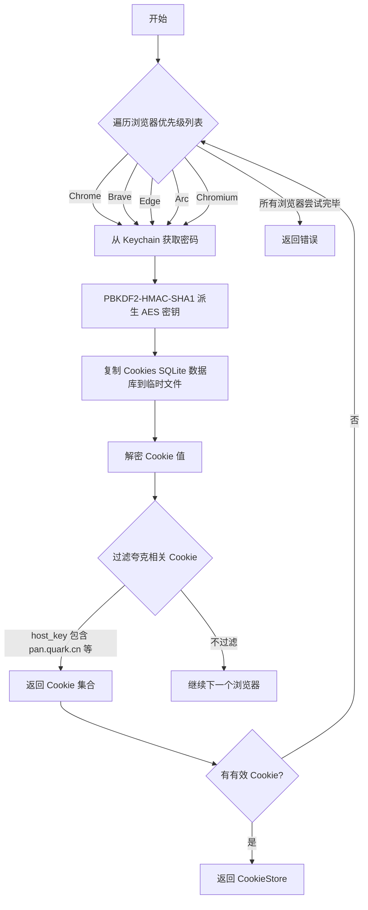
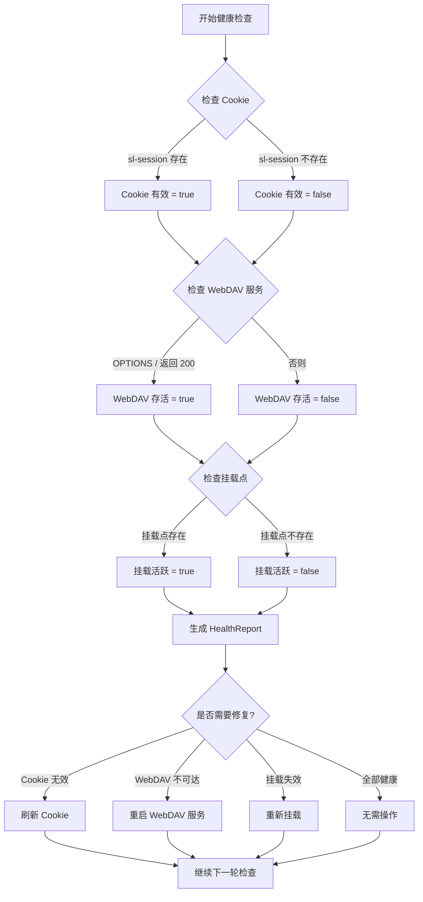
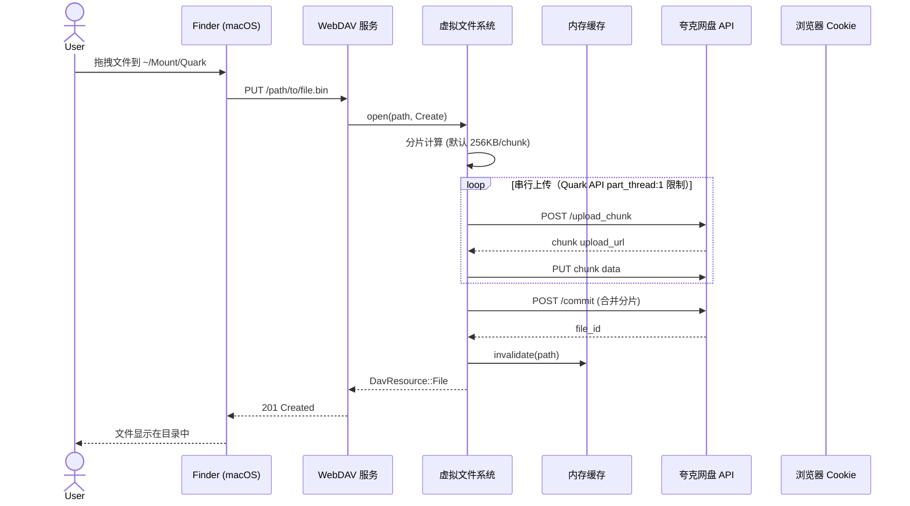
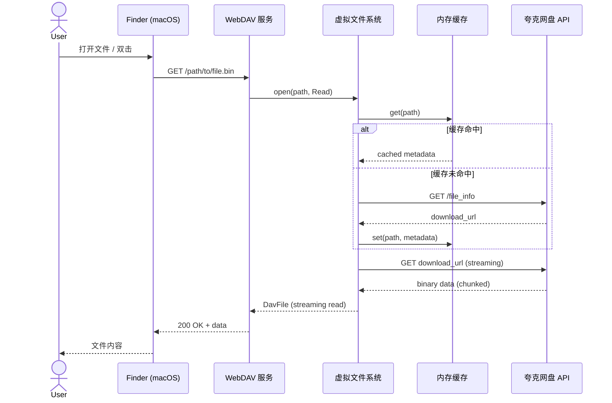

# QuarkDrive-WebDAV API 文档

> 仓库路径：`/Users/HawkSept/myproject/myapp/localquark-rust/`
> 最后更新：2026-07-05
>
> 本文档描述 QuarkDrive-WebDAV 提供的接口和配置方式。

## 架构速览

daemon 启动时会起 **两个** 端口：

| 端口 | 协议 | 角色 | 谁会用 |
|------|------|------|--------|
| `8080` | HTTP | WebDAV backend（dav-server 直连） | daemon 内部 / proxy.rs |
| `8443` | HTTPS | 终结代理（自签证书） | `mount_webdav` |

> macOS 26.6+ 的 `webdavfs_agent` 拒绝 HTTP + Basic Auth，必须走 8443。

---

## 目录
1. [命令行接口 (CLI)](#命令行接口-cli)
2. [WebDAV 协议接口](#webdav-协议接口)
3. [Cookie 抓取接口](#cookie-抓取接口)
4. [健康检查接口](#健康检测接口)
5. [环境变量](#环境变量)
6. [挂载点](#挂载点)
7. [错误码](#错误码)
8. [流程图](#流程图)

---

## 命令行接口 (CLI)

### 启动服务

```bash
quarkdrive-webdav [OPTIONS]
```

### 参数列表

| 参数 | 短参数 | 类型 | 默认值 | 说明 |
|------|--------|------|--------|------|
| `--quark-cookie` | `-c` | String | 无 | 夸克网盘 Cookie 字符串（分号分隔）。若未提供，则从浏览器自动抓取 |
| `--webdav-auth-user` | `-U` | String | `quasar` | WebDAV 认证用户名 |
| `--webdav-auth-password` | `-W` | String | 自动生成 | WebDAV 认证密码。若未提供，则生成随机令牌并保存到 `~/Library/Application Support/QuarkDrive/webdav.passwd` |
| `--host` |  | String | `127.0.0.1` | 监听地址（frontend HTTPS） |
| `--port` | `-p` | u16 | `8443` | HTTPS frontend 端口（mount_webdav 目标） |
| `--backend-host` |  | String | `127.0.0.1` | WebDAV backend 监听地址 |
| `--backend-port` |  | u16 | `8080` | WebDAV backend HTTP 端口（仅本地） |
| `--tls-cert` |  | Path | 自动生成 | TLS 证书路径，默认 `~/Library/Application Support/QuarkDrive/cert.pem` |
| `--tls-key` |  | Path | 自动生成 | TLS 私钥路径，默认 `~/Library/Application Support/QuarkDrive/key.pem` |
| `--mount-point` |  | Path | `~/Mount/Quark` | 挂载点路径。bundled `.app` 启动器覆盖为 `/Volumes/LocalQuark` |
| `--warm-root` |  | bool | `true` | 启动时主动 PROPFIND 一次根目录预热 moka 缓存 |
| `--cookie-refresh-secs` |  | u64 | `43200` | Cookie 抓取周期（秒），12 小时 |
| `--health-check-secs` |  | u64 | `60` | 健康检查周期（秒） |
| `--no-mount` |  | bool | `false` | 禁用自动挂载 |
| `--no-tray` |  | bool | `false` | 禁用菜单栏托盘 |
| `-h, --help` |  |  |  | 显示帮助信息 |

### 参数优先级
1. 命令行参数（最高优先级）
2. 对应的环境变量
3. 内置默认值

### 使用示例

```bash
# 基础启动（自动从浏览器抓取 Cookie）
quarkdrive-webdav

# 指定 Cookie 和认证信息
quarkdrive-webdav -c "sl-session=xxx; __pus=yyy" -U quasar -W secret

# 使用自定义 TLS 证书
quarkdrive-webdav --tls-cert /path/to/cert.pem --tls-key /path/to/key.pem

# 禁用挂载和托盘（仅作为普通 WebDAV 服务）
quarkdrive-webdav --no-mount --no-tray

# 修改默认端口（不推荐；macOS 26.6+ 强制 HTTPS）
quarkdrive-webdav --port 9443 --backend-port 9080

# 健康检查子命令（打印后退出）
quarkdrive-webdav health
```

> ⚠️ 当前不在 Docker 上游发布；如需自行打包，参考 [docs/DEPLOYMENT.md](DEPLOYMENT.md)。

---

## WebDAV 协议接口

### 支持的方法

| HTTP 方法 | WebDAV 语义 | 说明 |
|-----------|------------|------|
| `OPTIONS` | 服务发现 | 返回允许的 WebDAV 方法 |
| `PROPFIND` | 属性查找 | 获取文件/目录的元返回 |
| `PROPPATCH` | 属性修改 | 修改文件/目录属性 |
| `MKCOL` | 创建目录 | 创建新目录 |
| `GET` | 读取文件 | 下载文件内容 |
| `HEAD` | 读取元数据 | 仅返回响应头 |
| `PUT` | 写入文件 | 上传文件 |
| `DELETE` | 删除 | 删除文件或目录 |
| `COPY` | 复制 | 复制文件或目录 |
| `MOVE` | 移动/重命名 | 移动或重命名文件/目录 |
| `LOCK` | 锁定 | 锁定文件（防止并发修改） |
| `UNLOCK` | 解锁 | 释放锁定 |

### 认证

所有请求都需要 Basic Auth：

```
Authorization: Basic <base64(username:password)>
```

其中：
- `username` 通过 `--webdav-auth-user` 或 `WEBDAV_AUTH_USER` 设置（默认 `quasar`）
- `password` 通过 `--webdav-auth-password` 或 `WEBDAV_AUTH_PASSWORD` 设置（默认自动生成，落到 `~/Library/Application Support/QuarkDrive/webdav.passwd`）

### 状态码

| 状态码 | 场景 |
|--------|------|
| `200 OK` | 成功（GET / HEAD / OPTIONS） |
| `201 Created` | 成功创建（PUT / MKCOL） |
| `204 No Content` | 成功删除（DELETE） |
| `207 Multi-Status` | PROPFIND 响应（WebDAV 标准） |
| `401 Unauthorized` | 认证失败 |
| `404 Not Found` | 文件/目录不存在 |
| `409 Conflict` | 目录非空或锁冲突 |
| `423 Locked` | 文件被锁定 |

---

## Cookie 抓取接口

### `cookie::CookieStore`

```rust
pub struct CookieStore {
    inner: Arc<DashMap<String, String>>,
}

impl CookieStore {
    /// 从 Chromium 系浏览器抓取 Cookie
    ///
    /// # 参数
    /// * `priority` - 浏览器优先级列表，默认为 [Chrome, Brave, Edge, Arc, Chromium]
    ///
    /// # 返回值
    /// * `Ok(CookieStore)` - 成功抓取到 Cookie
    /// * `Err(anyhow::Error)` - 所有浏览器均失败
    pub async fn from_chromium(priority: &[BrowserKind]) -> Result<Self>;

    /// 获取指定 key 的 Cookie 值
    ///
    /// # 参数
    /// * `key` - Cookie 键名（如 "sl-session"）
    ///
    /// # 返回值
    /// * `Some(String)` - Cookie 值
    /// * `None` - 未找到对应 Cookie
    pub fn get(&self, key: &str) -> Option<String>;

    /// 导出所有 Cookie（用于调试）
    ///
    /// # 返回值
    /// * `HashMap<String, String>` - 所有 Cookie 键值对
    pub fn snapshot(&self) -> HashMap<String, String>;
}
```

### 支持的浏览器

| 浏览器 | 标识 | 优先级 | 说明 |
|--------|------|--------|------|
| Google Chrome | `chrome` | 1 | 默认最高优先级 |
| Brave | `brave` | 2 |  |
| Microsoft Edge | `edge` | 3 |  |
| Arc | `arc` | 4 |  |
| Chromium | `chromium` | 5 |  |

### Cookie 抓取流程


---

## 健康检测接口

### 内部检查（非 HTTP 接口）

`health.rs` 每 60 秒执行一次内部健康检查：

```rust
pub struct HealthReport {
    pub cookie_valid: bool,   // sl-session Cookie 是否存在且有效
    pub webdav_alive: bool,   // WebDAV 服务是否响应 OPTIONS /
    pub mount_active: bool,   // 挂载点是否正常挂载
}

impl HealthReport {
    /// 判断是否完全健康
    pub fn is_healthy(&self) -> bool {
        self.cookie_valid && self.webdav_alive && self.mount_active
    }
}
```

### 健康检查流程


### 手动检查挂载状态

```bash
# 查看挂载点
mount | grep "$HOME/Mount/Quark"
mount | grep "/Volumes/LocalQuark"   # bundled .app 走 /Volumes/LocalQuark

# 检查 WebDAV 服务
curl -X OPTIONS -u "quasar:<webdav.passwd 中的密码>" http://127.0.0.1:8080/

# 查看健康状态（通过托盘或日志）
```

---

## 环境变量

| 变量名 | 说明 | 示例 | 对应命令行参数 |
|--------|------|------|----------------|
| `QUARK_COOKIE` | 夸克网盘 Cookie | `__pus=xxx; __puus=yyy` | `--quark-cookie` |
| `WEBDAV_AUTH_USER` | WebDAV 用户名 | `quasar` | `--webdav-auth-user` |
| `WEBDAV_AUTH_PASSWORD` | WebDAV 密码 | `secret` | `--webdav-auth-password` |
| `PORT` | HTTPS frontend 端口 | `8443` | `--port` |
| `TLS_CERT` | TLS 证书路径 | `/path/to/cert.pem` | `--tls-cert` |
| `TLS_KEY` | TLS 私钥路径 | `/path/to/key.pem` | `--tls-key` |
| `MOUNT_POINT` | 挂载点路径 | `/Users/username/Mount/Quark` | `--mount-point` |
| `NO_MOUNT` | 禁用自动挂载 | `true` | `--no-mount` |
| `NO_TRAY` | 禁用菜单栏托盘 | `true` | `--no-tray` |
| `RUST_LOG` | 日志级别 | `info`, `debug`, `trace` | 无（通过环境变量设置） |

> **注意**：环境变量优先级低于对应的命令行参数。例如，如果同时设置了 `QUARK_COOKIE` 环境变量和 `--quark-cookie` 命令行参数，则使用命令行参数的值。

---

## 挂载点

### macOS

```bash
# 手动挂载（应用内部自动执行，bundled .app 默认走 /Volumes/LocalQuark）
mount_webdav -S -o url=https://127.0.0.1:8443,username=quasar,password=<from-webdav.passwd> ~/Mount/Quark

# 手动卸载
umount ~/Mount/Quark
diskutil umount force ~/Mount/Quark

# 查看已挂载的文件系统
mount | grep -i quark
```

### 挂载参数说明
- `-S`：允许不安全的 SSL（用于自签名证书）
- `url`：WebDAV 服务地址（通常是 `https://127.0.0.1:8443`）
- `username`：WebDAV 认证用户名
- `password`：WebDAV 认证密码
- `~/Mount/Quark`：本地挂载点路径

---

## 文件操作流程图

### 文件上传流程（PUT）


### 文件下载流程（GET）


---

## 常见问题

### Finder 中挂载点显示为空？

1. 尝试在 Finder 中按 `Cmd + R` 刷新当前目录
2. 若仍为空，尝试重启应用：`killall quarkdrive-webdav; ./target/release/quarkdrive-webdav`
3. 检查 WebDAV 服务是否正常：`curl -X PROPFIND -u quasar:<passwd> https://127.0.0.1:8443/`

### 上传大文件时 Finder 挂起？

这是 macOS `mount_webdav` 的已知限制。建议通过命令行上传大文件或使用专门的 WebDAV 客户端（如 CyberDuck）。

### Cookie 抓取失败？

确保：
- 浏览器（Chrome 等）已登录夸克网盘并保持运行
- 浏览器未使用主密码（Master Password）加密 Cookie
- Keychain 访问权限未被系统限制

---

## 性能优化

本项目经过三轮系统性性能优化：

| 阶段 | 优化内容 | 效果 |
|------|---------|------|
| **Phase 1** | ❌ `upload_chunk` 尝试 `buffer_unordered(4)` 并发；因 Quark API `part_thread:1` 限制触发 `PartNotSequential`，已回滚为串行 | 历史版本 5MB 上传曾达 ~8s；当前为 API 串行耗时 |
| **Phase 2** | 删除 8 处多余的 `sleep` 延迟（缓存同步） | 目录列表从 ~2s → ~200ms |
| **Phase 3** | 移除 `consume_buf` 的每写 `flush()` | 减少磁盘 IO syscall，内存占用 -26% |

> 真实状态与可复现测试见 [PERFORMANCE.md](PERFORMANCE.md)。

---


*最后更新：2026-07-05*
